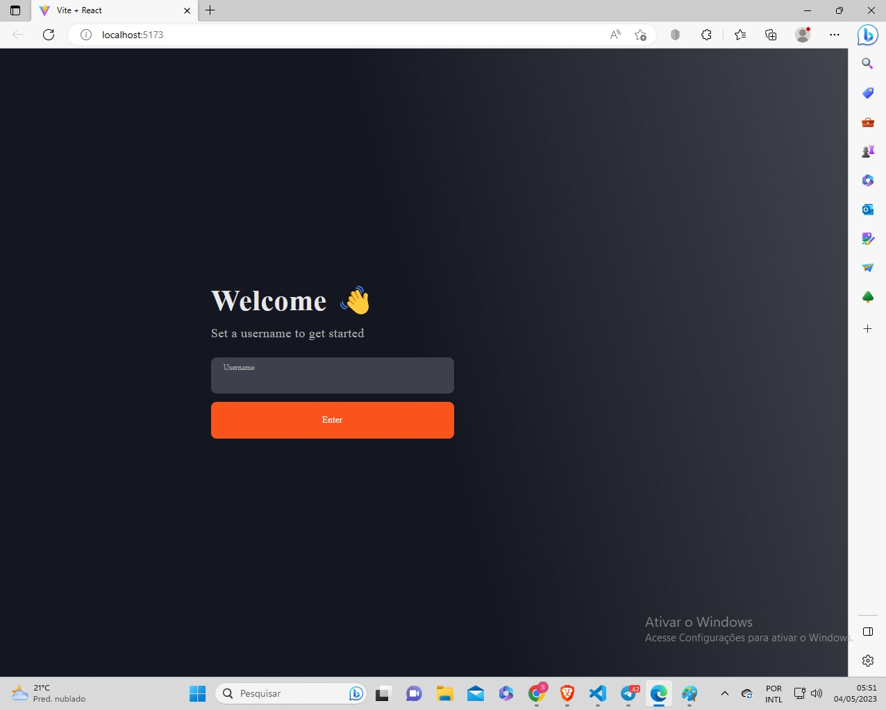
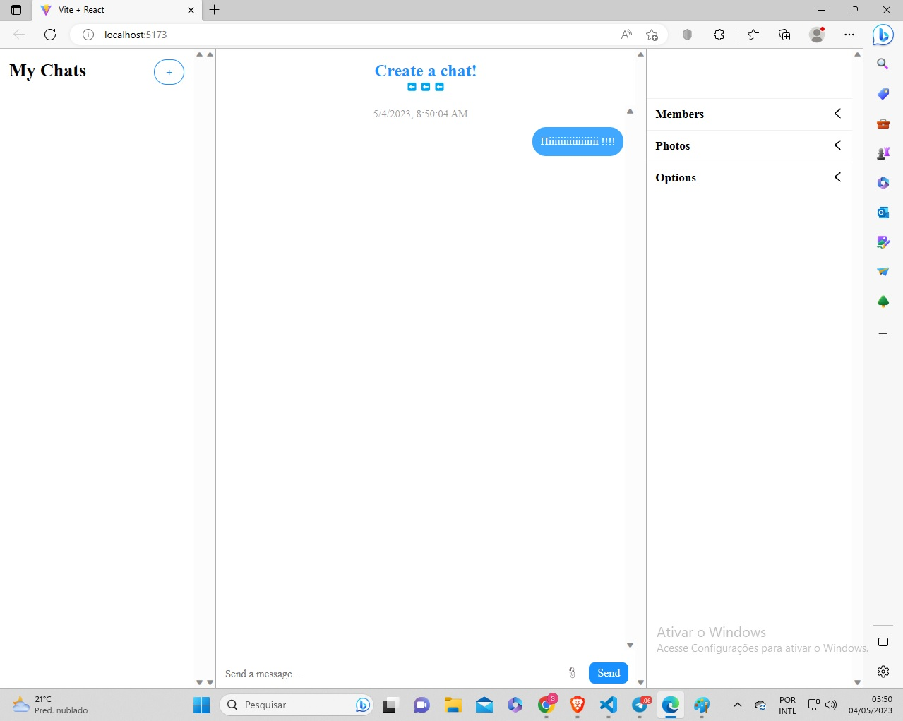

This project consists of implementing the chatengine.io application

Developed in React JavaScript (frontend) and Node JavaScript (backend), it is a multi-channel platform, allowing online users to chat as a social network on the platform as an instant messaging app like Telegram, but with fewer resources but highly functional and useful.

It is also possible to create a single chat with the system admin, serving as a direct contact application on a customer's site with the owner/server (applications: support, sales, doubts, etc. real time conversation)

Implementation: install the required dependencies with:

npm install

(dependencies/technologies used: "dependencies": {
    "axios": "^1.4.0",
    "colors": "^2.8.5",
    "express": "^4.18.2"
  },
 "devDependencies": {
    "nodemon": "^2.0.22"
  }
)

---

Single conversation implementation: change the ChatsPage.jsx file to:

```
import { PrettyChatWindow } from 'react-chat-engine-pretty'

const ChatsPage = (props) => {
    return(
        <div style={{height: '100vh'}}>
            <PrettyChatWindow
                projectId=''project-id-from-site-here'
                username={props.user.username}
                secret={props.user.username}
                style={{height: '100%'}}
            />
        </div>
    )
  }

export default ChatsPage
```

*end (remember to include your projectId, register on the chatengine.io website, it gives you 30 days of free access to the system, after that your monthly fee is 7 dollars a month)

After changing the file, in the frontend folder:

npm install react-chat-engine-pretty


----

Testing as in-house development (nodemon)

1st- in the index.js file include the private-key of the chatengine.io site in the headers, ex:
{ headers: { "private-key": "here-your-private-key-from-site" } }; in the ChatsPage.jsx file it is also necessary to include the site's project-id.

2nd - if you have the file just downloaded/unaltered, it will be in multi channel mode, so in the frontend folder install: npm install react-chat-engine-pretty

3o- in the backend folder: npm run start

4th - in the frontend folder: npm run dev

---

PICS: 
